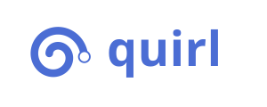

# Quirl



A reusable UI component library for [Duck Framework's](https://duckframework.com) Lively reactive system.

Build consistent, themeable interfaces in pure Python — no separate frontend toolchain, no JavaScript bundling, no build steps for your UI logic.

---

## What is quirl?

quirl provides a structured foundation for creating and documenting Duck Lively components. It handles theming, animation demos, and static documentation generation so you can focus on building interfaces, not boilerplate.

- **Themeable by default** — Design tokens flow through CSS custom properties; every component inherits from a shared theme without hardcoded values.
- **Self-documenting** — Components declare their own usage docs via markdown docstrings. A build script turns those into a static gallery.
- **Animated demos without a server** — Wrap any component in a Demo container to generate pure HTML/CSS/JS showcases. Deploy to GitHub Pages with zero hosting cost.
- **No inheritance lock-in** — The demo system works with any Duck component, built-in or third-party, without requiring base class changes.

---

## Installation

```bash
pip install quirl
```

Requires Python 3.10+ and `duckframework>=2.3.1`.

---

## Quick start

### 1. Define a theme

```python
from quirl.theme import Theme

dark = Theme(
    name="dark",
    accent_color="#F5C842",
    surface_color="#111318",
)

# Update the global theme
Theme.current = dark
```

### 2. Create a component

Inherit from Duck's built-in components. Write your docs as a markdown class docstring:

```python
from duck.html.components.label import Label

class StatusLabel(Label):
    """
    A themed label for displaying status text.

    Usage:
    ```python
    StatusLabel(text="Active", color="green")
    ```

    Required Props:
    - text: Display text
    
    Optional Props:
    - color: The text color for the label
    """
    
    # Preview kwargs for the demo
    docs_preview_kwargs = {"text": "Preview", "color": "#3b82f6"}
    
    # Demo animation steps
    docs_animation_steps = [
        {"delay": 1000, "cursor": {"top": "50%", "left": "50%"}},
        {"delay": 500, "target": "span", "click": True},
    ]

    def on_create(self):
        super().on_create()
        
        # Update style
        self.style.update({
            "border-radius": "9999px",
            "padding": "4px 12px",
            "font-weight": "500",
        })
```

### 3. Render a static demo

```python
from duck.html.components.container import Container
from duck.html.components.button import Button
from duck.html.components.input import Input

from quirl.components import Demo


# Demo a built-in Button
button_demo = Demo(
    component=Button(text="Submit", bg_color="blue", color="white"),
    steps=[
        {"delay": 1000, "cursor": {"target": "button"}},
        {"delay": 500, "target": "button", "click": True},
        {"delay": 2000},
    ],
    title="Button",
)

# Demo a built-in Input
input_demo = Demo(
    component=Input(type="text", name="email", placeholder="Email"),
    steps=[
        {"delay": 800, "cursor": {"top": "50%", "left": "30%"}},
        {"delay": 1000, "target": "input", "click": True},
        {"delay": 1500},
    ],
    title="Input",
)

# Group components
container = Container(children=[button_demo, input_demo])

# Render to static HTML
html = container.render()
```

Deploy the output to GitHub Pages, Netlify, or any static host. No Python runtime required on the server.

---

## Architecture

quirl is organized around three concerns: theming, documentation, and animation demos.

The theme system lives at the package root and provides extensible design tokens through a global class-level registry. Access the active theme anywhere via `Theme.current`.

The animation demo system lives under `quirl.components.animation.demo` and wraps any Duck component for static HTML output. It generates self-contained CSS animations and click simulations without a WebSocket connection or Python runtime on the client.

---

## Development

**quirl** follows the Duck Framework code style:

- Google-style docstrings on every module, class, and method.
- Constructor-based initialization via kwargs only.
- No private-style method names (build_nav, not _build_nav).
- Components live in quirl/components/, themes and utilities at the package root.

---

## License

See [LICENSE](./LICENSE).

